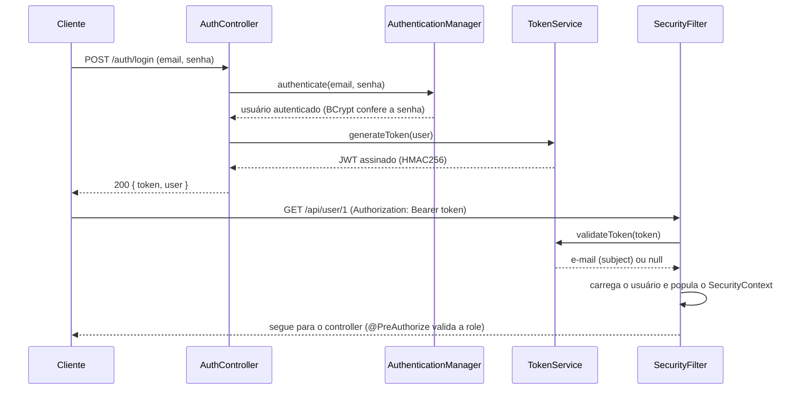
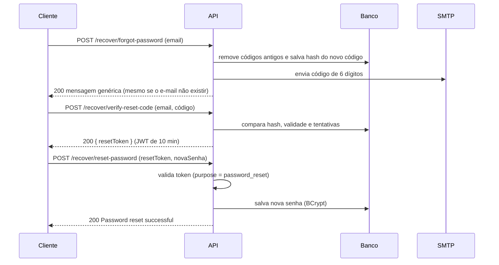

# 🔐 Login System — API de Autenticação e Gerenciamento de Usuários

API REST de autenticação construída com **Spring Boot**, **Spring Security** e **JWT**. O projeto cobre o ciclo completo de contas de usuário: cadastro, login, controle de acesso por papéis (roles), CRUD de usuários e recuperação de senha por código enviado por e-mail.


---

## 📑 Sumário

- [Funcionalidades](#-funcionalidades)
- [Tecnologias](#-tecnologias)
- [Arquitetura e estrutura de pastas](#-arquitetura-e-estrutura-de-pastas)
- [Modelo de dados](#-modelo-de-dados)
- [Como a autenticação funciona](#-como-a-autenticação-funciona)
- [Recuperação de senha](#-recuperação-de-senha)
- [Endpoints da API](#-endpoints-da-api)
- [Validações](#-validações)
- [Tratamento de erros](#-tratamento-de-erros)
- [Segurança](#-segurança)
- [Como executar](#-como-executar)
- [Documentação interativa (Swagger)](#-documentação-interativa-swagger)
- [Testes](#-testes)
- [Fluxo de trabalho com Git](#-fluxo-de-trabalho-com-git)
- [Melhorias futuras](#-melhorias-futuras)
- [Autor](#-autor)

---

## ✨ Funcionalidades

- **Cadastro** de usuários com senha criptografada (BCrypt) e role padrão `ROLE_USER`.
- **Login** com e-mail e senha, retornando um **token JWT** (validade de 2 horas) e os dados do usuário.
- **Autenticação stateless**: nenhuma sessão é mantida no servidor; cada requisição protegida envia o token no header `Authorization`.
- **Autorização por roles** (`ROLE_USER` e `ROLE_ADMIN`) com `@PreAuthorize`.
- **CRUD de usuários** com busca por id, username e e-mail, listagem paginada (somente admin), atualização total (`PUT`) e parcial (`PATCH`), troca de role e exclusão.
- **Recuperação de senha em 3 etapas**: envio de código por e-mail → verificação do código → redefinição da senha com token temporário.
- **Tratamento global de exceções** com resposta de erro padronizada em JSON.
- **Validação de entrada** com Bean Validation (mensagens claras por campo).
- **Documentação interativa** com Swagger UI e suporte a Bearer Token.

---

## 🛠 Tecnologias

| Categoria | Tecnologia                                                                  |
|---|-----------------------------------------------------------------------------|
| Linguagem | Java 21                                                                     |
| Framework | Spring Boot 4.1.1 (Web MVC, Data JPA, Validation, Mail)                     |
| Segurança | Spring Security, `java-jwt` (Auth0) 4.6.1, BCrypt                           |
| Banco de dados | MySQL (driver `mysql-connector-j`)                                          |
| ORM | Hibernate / Spring Data JPA                                                 |
| Migrations | Flyway (dependência incluída, ver [Melhorias futuras](#-melhorias-futuras)) |
| Documentação | springdoc-openapi 3.1.0 (Swagger UI)                                        |
| E-mail | Spring Mail via SMTP do Gmail                                               |
| Produtividade | Lombok, Spring Boot DevTools                                                |
| Build | Maven (com Maven Wrapper)                                                   |

---

## 🧱 Arquitetura e estrutura de pastas

O projeto segue uma arquitetura em camadas: **Controller → Service → Repository → Banco**, com DTOs para entrada/saída e uma camada dedicada de segurança.

```
login-system/
├── pom.xml
├── mvnw / mvnw.cmd                  # Maven Wrapper
├── .env                             # variáveis sensíveis (NÃO versionado)
└── src/
    ├── main/
    │   ├── java/com/lucasberbel01/loginsystem/
    │   │   ├── LoginSystemApplication.java
    │   │   ├── config/
    │   │   │   ├── SecurityConfig.java        # filter chain, rotas públicas, BCrypt, AuthenticationManager
    │   │   │   └── SwaggerConfig.java         # esquema de segurança "bearerAuth" (JWT)
    │   │   ├── controller/
    │   │   │   ├── AuthController.java        # /auth  → login e cadastro
    │   │   │   ├── PasswordRecoverController.java  # /recover → recuperação de senha
    │   │   │   └── UserController.java        # /api/user → CRUD de usuários
    │   │   ├── service/
    │   │   │   ├── UserService.java           # regras de negócio de usuários
    │   │   │   └── PasswordResetService.java  # geração/validação de código e envio de e-mail
    │   │   ├── repository/
    │   │   │   ├── UserRepository.java
    │   │   │   └── PasswordResetCodeRepository.java
    │   │   ├── model/
    │   │   │   ├── User.java                  # entidade tb_user
    │   │   │   └── PasswordResetCode.java     # entidade password_reset_code
    │   │   ├── enums/
    │   │   │   └── UserRole.java              # ROLE_USER, ROLE_ADMIN
    │   │   ├── dto/                           # records de request/response
    │   │   ├── security/
    │   │   │   ├── SecurityFilter.java        # filtro que lê e valida o JWT em cada requisição
    │   │   │   ├── TokenService.java          # geração/validação dos tokens (login e reset)
    │   │   │   ├── CustomUserDetails.java     # adapta User para o Spring Security
    │   │   │   ├── UserDetailsServiceImpl.java
    │   │   │   └── CodeUtils.java             # gera o código de 6 dígitos e faz o hash SHA-256
    │   │   └── exception/
    │   │       ├── GlobalExceptionHandler.java
    │   │       ├── BusinessException.java     # base abstrata (carrega o HttpStatus)
    │   │       └── *Exception.java            # exceções de negócio específicas
    │   └── resources/
    │       └── application.properties
    └── test/
        └── java/.../LoginSystemApplicationTests.java
```

---

## 🗄 Modelo de dados

### `tb_user`

| Coluna | Tipo | Restrições |
|---|---|---|
| `id` | `BIGINT` | PK, auto incremento |
| `username` | `VARCHAR` | obrigatório, **único** |
| `password` | `VARCHAR` | obrigatório (hash BCrypt) |
| `email` | `VARCHAR` | obrigatório, **único** |
| `role` | `ENUM (STRING)` | obrigatório — `ROLE_USER` ou `ROLE_ADMIN` |

### `password_reset_code`

| Coluna | Tipo | Descrição |
|---|---|---|
| `id` | `BIGINT` | PK, auto incremento |
| `user_email` | `VARCHAR` | e-mail do usuário que solicitou o código |
| `code` | `VARCHAR` | **hash SHA-256 (Base64)** do código — o código em texto puro nunca é salvo |
| `expiry_date` | `DATETIME` | validade do código (5 minutos) |
| `attempts` | `INT` | contador de tentativas de verificação |

---

## 🔑 Como a autenticação funciona



**Detalhes do token de login (JWT):**

| Item | Valor |
|---|---|
| Algoritmo | HMAC256 (segredo vem da variável `JWTSECRET`) |
| Issuer | `loginsystem-api` |
| Subject | e-mail do usuário |
| Claims extras | `role`, `id` |
| Validade | 2 horas |

Para acessar rotas protegidas, envie o header:

```
Authorization: Bearer <seu_token>
```

---

## 🔁 Recuperação de senha

O fluxo é dividido em três etapas, sem nunca expor se um e-mail existe ou não na base.



**Regras do fluxo:**

- O código tem **6 dígitos**, é gerado com `SecureRandom` e **expira em 5 minutos**.
- Apenas o **hash SHA-256** do código é armazenado.
- Cada novo pedido apaga os códigos anteriores do mesmo e-mail.
- Limite de **5 tentativas** por código.
- Após a verificação, o código é descartado e um **token temporário de 10 minutos** é emitido. Ele é assinado com uma chave **diferente** (`SIGNKEY`) da usada no login e carrega o claim `purpose = password_reset`, o que impede que um token de login seja usado para redefinir senha (e vice-versa).

---

## 📡 Endpoints da API

**URL base (local):** `http://localhost:8080`

### Legenda de acesso

| Ícone | Significado |
|---|---|
| 🌐 | Público (sem token) |
| 🔒 | Requer token JWT válido |
| 🛡️ | Requer role `ROLE_ADMIN` |

### Autenticação — `/auth`

| Método | Rota | Acesso | Descrição |
|---|---|---|---|
| `POST` | `/auth/register` | 🌐 | Cria uma conta (role `ROLE_USER`). Retorna `201` com header `Location`. |
| `POST` | `/auth/login` | 🌐 | Autentica e retorna o token JWT + dados do usuário. |

### Recuperação de senha — `/recover`

| Método | Rota | Acesso | Descrição |
|---|---|---|---|
| `POST` | `/recover/forgot-password` | 🌐 | Envia o código de recuperação por e-mail. |
| `POST` | `/recover/verify-reset-code` | 🌐 | Valida o código e devolve o `resetToken`. |
| `POST` | `/recover/reset-password` | 🌐 | Define a nova senha usando o `resetToken`. |

### Usuários — `/api/user`

| Método | Rota | Acesso | Descrição |
|---|---|---|---|
| `GET` | `/api/user/all` | 🛡️ | Lista usuários com paginação (padrão: `size=10`, ordenado por `username`). |
| `GET` | `/api/user/{id}` | 🔒 | Busca usuário por id. |
| `GET` | `/api/user/username/{username}` | 🔒 | Busca usuário por username. |
| `GET` | `/api/user/email/{email}` | 🔒 | Busca usuário por e-mail. |
| `PUT` | `/api/user/{id}` | 🔒 Admin ou o próprio usuário | Atualiza username, e-mail e (opcionalmente) senha. Não altera a role. |
| `PATCH` | `/api/user/{id}` | 🔒 Admin ou o próprio usuário | Atualização parcial — só os campos enviados são alterados. |
| `PATCH` | `/api/user/role/{id}` | 🔒 conforme `@PreAuthorize` do controller | Altera a role do usuário. |
| `DELETE` | `/api/user/{id}` | 🔒 Admin ou o próprio usuário | Remove o usuário (`204 No Content`). |

> A listagem aceita os parâmetros padrão do Spring: `?page=0&size=10&sort=username,asc`.

### Exemplos de uso

<details>
<summary><b>Cadastro</b> — <code>POST /auth/register</code></summary>

```bash
curl -X POST http://localhost:8080/auth/register \
  -H "Content-Type: application/json" \
  -d '{
    "username": "maria",
    "email": "maria@exemplo.com",
    "password": "Senha@123"
  }'
```

Resposta `201 Created`:

```json
{
  "id": 1,
  "username": "maria",
  "email": "maria@exemplo.com",
  "role": "ROLE_USER"
}
```
</details>

<details>
<summary><b>Login</b> — <code>POST /auth/login</code></summary>

```bash
curl -X POST http://localhost:8080/auth/login \
  -H "Content-Type: application/json" \
  -d '{
    "email": "maria@exemplo.com",
    "password": "Senha@123"
  }'
```

Resposta `200 OK`:

```json
{
  "token": "eyJhbGciOiJIUzI1NiIsInR5cCI6IkpXVCJ9...",
  "user": {
    "id": 1,
    "username": "maria",
    "email": "maria@exemplo.com",
    "role": "ROLE_USER"
  }
}
```
</details>

<details>
<summary><b>Buscar usuário autenticado</b> — <code>GET /api/user/{id}</code></summary>

```bash
curl http://localhost:8080/api/user/1 \
  -H "Authorization: Bearer <seu_token>"
```
</details>

<details>
<summary><b>Atualização parcial</b> — <code>PATCH /api/user/{id}</code></summary>

```bash
curl -X PATCH http://localhost:8080/api/user/1 \
  -H "Authorization: Bearer <seu_token>" \
  -H "Content-Type: application/json" \
  -d '{ "username": "maria_silva" }'
```
</details>

<details>
<summary><b>Alterar role</b> — <code>PATCH /api/user/role/{id}</code></summary>

O corpo da requisição é o valor do enum como string JSON:

```bash
curl -X PATCH http://localhost:8080/api/user/role/2 \
  -H "Authorization: Bearer <token_de_admin>" \
  -H "Content-Type: application/json" \
  -d '"ROLE_ADMIN"'
```
</details>

<details>
<summary><b>Recuperação de senha</b> — fluxo completo</summary>

**1. Solicitar o código**

```bash
curl -X POST http://localhost:8080/recover/forgot-password \
  -H "Content-Type: application/json" \
  -d '{ "email": "maria@exemplo.com" }'
```

```json
{ "message": "If the email exists, we will send a reset code to it" }
```

**2. Verificar o código recebido por e-mail**

```bash
curl -X POST http://localhost:8080/recover/verify-reset-code \
  -H "Content-Type: application/json" \
  -d '{ "email": "maria@exemplo.com", "code": "123456" }'
```

```json
{ "resetToken": "eyJhbGciOiJIUzI1NiIs..." }
```

**3. Redefinir a senha**

```bash
curl -X POST http://localhost:8080/recover/reset-password \
  -H "Content-Type: application/json" \
  -d '{ "resetToken": "eyJhbGciOiJIUzI1NiIs...", "password": "NovaSenha@456" }'
```

```json
{ "message": "Password reset successful" }
```
</details>

---

## ✅ Validações

| Campo | Regra |
|---|---|
| `username` | Obrigatório, entre 3 e 100 caracteres |
| `email` | Obrigatório, formato de e-mail válido |
| `password` | Obrigatório, mínimo de 6 caracteres, com **1 número**, **1 letra maiúscula** e **1 caractere especial** (`@ # $ % ^ & + = !`) |
| `code` (recuperação) | Exatamente 6 dígitos numéricos |
| `resetToken` | Obrigatório |

Regras de negócio adicionais:

- `username` e `email` são **únicos** — a unicidade é verificada nas atualizações (`PUT`/`PATCH`), retornando `409 Conflict`.
- No `PATCH`, campos `null` ou em branco são simplesmente ignorados.

---

## 🚨 Tratamento de erros

Todas as respostas de erro seguem o mesmo formato, definido em `ErrorResponse`:

```json
{
  "timestamp": "2026-09-23T19:30:00Z",
  "status": 400,
  "error": "Bad Request",
  "message": "Validation errors in the sent fields",
  "path": "/auth/register",
  "details": [
    "password: Passwords must contain a number, a capital letter and a special character"
  ]
}
```

| Situação | Exceção | Status |
|---|---|---|
| Campos inválidos (`@Valid`) | `MethodArgumentNotValidException` | `400 Bad Request` (com lista em `details`) |
| Código de recuperação inválido/expirado | `InvalidResetCodeException` | `400 Bad Request` |
| E-mail ou senha incorretos | `EmailOrPasswordIncorrectException` | `401 Unauthorized` |
| Usuário não encontrado | `UserNotFoundException` | `404 Not Found` |
| Username já em uso | `UsernameAlreadyTakenException` | `409 Conflict` |
| E-mail já em uso | `EmailAlreadyTakenException` | `409 Conflict` |
| Erro inesperado | `Exception` | `500 Internal Server Error` (mensagem genérica, detalhes só no log) |

Todas as exceções de negócio herdam de `BusinessException`, que carrega o `HttpStatus` — adicionar um novo erro é criar uma classe que estende `BusinessException`.

---

## 🛡 Segurança

- **Senhas** armazenadas com **BCrypt**; nunca retornadas nas respostas (o `UserResponseDTO` não expõe o campo).
- **JWT stateless** (`SessionCreationPolicy.STATELESS`), com CSRF desabilitado por não haver sessão/cookie.
- **Dois segredos independentes**: `JWTSECRET` (token de login) e `SIGNKEY` (token de redefinição de senha).
- **Códigos de recuperação** salvos apenas como hash SHA-256, com expiração e limite de tentativas.
- **Resposta genérica** em `/recover/forgot-password`, evitando enumeração de e-mails cadastrados.
- **Mensagem única** para falha de login ("Wrong email or password"), sem distinguir e-mail inexistente de senha errada.
- **Segredos fora do código**: credenciais de banco, e-mail e chaves JWT são lidas do arquivo `.env`, listado no `.gitignore`.
- **Autorização em nível de método** com `@EnableMethodSecurity` + `@PreAuthorize`.
- Rotas públicas: `/auth/login`, `/auth/register`, `/recover/*`, `/swagger-ui/**`, `/v3/api-docs/**`. Qualquer outra rota exige autenticação.

---

## 🚀 Como executar

### Pré-requisitos

- **JDK 17** ou superior
- **MySQL** em execução
- **Maven** (opcional — o projeto já inclui o Maven Wrapper)
- Uma conta **Gmail com senha de app** (necessária para o envio dos e-mails de recuperação)

### 1. Clonar o repositório

```bash
git clone https://github.com/lucasberbel01/Auth-System.git
cd Auth-System
```

### 2. Criar o banco de dados

```sql
CREATE DATABASE nome_do_banco CHARACTER SET utf8mb4 COLLATE utf8mb4_unicode_ci;
```

As tabelas `tb_user` e `password_reset_code` são geradas pelo Hibernate a partir das entidades (o projeto ainda não possui scripts de migration).

### 3. Configurar o arquivo `.env`

Crie um arquivo `.env` na **raiz do projeto** (no mesmo diretório de onde você executa a aplicação). Ele é carregado pelo `application.properties` via `spring.config.import`.

```properties
# Banco de dados
DBURL=jdbc:mysql://localhost:3306/nome_do_banco
DBUSER=seu_usuario_mysql
DBPASSWORD=sua_senha_mysql

# JWT
JWTSECRET=uma_chave_longa_e_aleatoria_para_o_token_de_login
SIGNKEY=outra_chave_diferente_para_o_token_de_reset_de_senha

# E-mail (Gmail)
EMAILFROM=seu_email@gmail.com
EMAILPASSWORD=sua_senha_de_app_do_gmail
```

| Variável | Para que serve |
|---|---|
| `DBURL` | URL JDBC de conexão com o MySQL |
| `DBUSER` / `DBPASSWORD` | Credenciais do banco |
| `JWTSECRET` | Segredo HMAC que assina o token de **login** |
| `SIGNKEY` | Segredo HMAC que assina o token de **redefinição de senha** |
| `EMAILFROM` | Conta Gmail usada como remetente |
| `EMAILPASSWORD` | **Senha de app** do Gmail (não é a senha normal da conta) |

> 💡 **Dica:** gere segredos fortes com `openssl rand -base64 64`. Use valores **diferentes** para `JWTSECRET` e `SIGNKEY`.
>
> 💡 **Gmail:** ative a verificação em duas etapas e crie uma *senha de app* em <https://myaccount.google.com/apppasswords>.
>
> ⚠️ **Nunca** faça commit do `.env`. Ele já está no `.gitignore`.

### 4. Executar a aplicação

```bash
# Linux / macOS
./mvnw spring-boot:run

# Windows
mvnw.cmd spring-boot:run
```

A API ficará disponível em `http://localhost:8080`.

### 5. Gerar o `.jar` (opcional)

```bash
./mvnw clean package
java -jar target/login-system-0.0.1-SNAPSHOT.jar
```

> Execute o `.jar` a partir da pasta onde está o `.env`, pois o arquivo é resolvido a partir do diretório de trabalho.

### 6. Criando o primeiro administrador

Todo cadastro público nasce como `ROLE_USER`. Para criar o primeiro admin, registre um usuário normalmente e altere a role diretamente no banco:

```sql
UPDATE tb_user SET role = 'ROLE_ADMIN' WHERE email = 'seu_email@exemplo.com';
```

Faça login novamente para receber um token com a nova role.

---

## 📖 Documentação interativa (Swagger)

Com a aplicação rodando, acesse:

| Recurso | URL |
|---|---|
| Swagger UI | <http://localhost:8080/swagger-ui.html> |
| OpenAPI (JSON) | <http://localhost:8080/v3/api-docs> |

Para testar rotas protegidas: faça login em `/auth/login`, copie o `token`, clique em **Authorize** e cole o valor (o prefixo `Bearer` é adicionado automaticamente pelo esquema `bearerAuth`).

---

## 🧪 Testes

Atualmente existe um teste de contexto (`LoginSystemApplicationTests.contextLoads`), que verifica se a aplicação Spring sobe corretamente. Ele exige o `.env` configurado e o banco acessível.

```bash
./mvnw test
```

O `pom.xml` já inclui os starters de teste de Security, Web MVC, JPA, Validation, Mail e Flyway, prontos para receber testes de unidade e integração.

---

## 🌿 Fluxo de trabalho com Git

O desenvolvimento foi organizado por *feature branches* integradas via Pull Request na `main`:

| Branch | Entrega |
|---|---|
| `feature/DTOs-do-model-User` | Model `User`, enum de roles e DTOs |
| `feature/UserRepository-e-UserService` | Repositório, service e regras de negócio |
| `feature/UserController` | Endpoints REST de usuário |
| `fix/getAll-pageable` | Valores padrão de paginação e separação do `AuthController` |
| `feature/autenticacao-jwt-e-permissoes` | JWT, Spring Security, roles e Swagger |
| `feature/forgot-password` | Recuperação de senha por e-mail |
| `feature/global-exception-handler` | Tratamento global de exceções e `ErrorResponse` |

---

## 🔭 Melhorias futuras

- Adotar **migrations Flyway** (a dependência já está no projeto) e usar `spring.jpa.hibernate.ddl-auto=validate` para versionar o schema.
- Ampliar a cobertura de **testes** (unidade e integração) para services, controllers e regras de segurança.
- Implementar **refresh token** e/ou lista de revogação de tokens.
- Adicionar **rate limiting** nas rotas públicas (login, cadastro e recuperação de senha).
- Configurar **CORS** para integração com front-end.
- Adicionar **Docker / Docker Compose** (aplicação + MySQL) para facilitar a execução.
- Confirmação de e-mail no cadastro e suporte a 2FA.
- Definir uma **licença** para o repositório.
